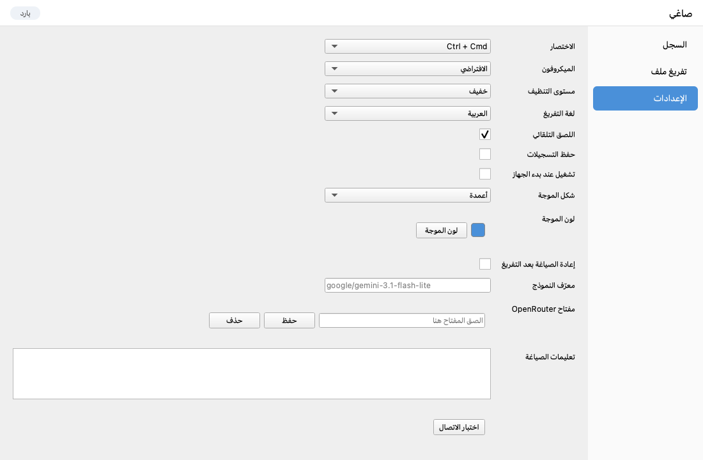

# Saghi-mac

Free Arabic voice typing for Apple-silicon Macs. It runs fully offline, on your Mac. Your voice never leaves the device.

Hold a hotkey, speak Arabic, let go. Saghi-mac turns your speech into clean text and pastes it where you were typing.

## Requirements

- A Mac with Apple silicon (M1 or newer). Intel Macs are not supported.
- macOS 13 (Ventura) or newer.
- About 10 GB of free disk space (the model alone is about 4 GB).
- 8 GB of RAM or more is recommended.

## Install

1. Open the latest release: https://github.com/alpha2xyz/Saghi-mac/releases/latest
2. Download `Install-Saghi-mac.command` from the release assets.
3. Double-click it. The first time, macOS Gatekeeper will block it because it is not signed:
   - macOS 15 (Sequoia) or newer: double-click the file, then open System Settings, Privacy & Security, scroll down and click **Open Anyway**, then confirm.
   - macOS 13 or 14: Control-click the file, choose **Open**, then click **Open** again.
4. The installer downloads the app (several GB), checks it, and installs Saghi to `~/Applications/Saghi.app`. It needs an internet connection only for this step. No admin password is needed.
5. It asks if you want Saghi to start at login (default: no).

To install a specific version, run the installer with `SAGHI_RELEASE_TAG=v0.1.0`.

## Permissions

macOS asks for these the first time you use each feature (System Settings, Privacy & Security):

| Permission | Why |
|---|---|
| Microphone | To record your voice. |
| Input Monitoring | To detect the global hotkey from any app. |
| Accessibility | To paste the text into the active app. |

Look for **Saghi** in each list and switch it on. If you see `python3.12` instead, switch that one on.

## Usage

1. Click into any text field: browser, Notes, WhatsApp, Word, anything.
2. Hold the hotkey. The default is **Control + Command** (you can switch to Option + Command in Settings).
3. Speak.
4. Release the keys. The text is cleaned (hesitation sounds removed) and pasted. It is also kept on the clipboard.
5. Press **Esc** before releasing to cancel a recording.

Open the **File transcription** page to transcribe audio or video files (WAV, MP3, M4A, AAC, FLAC, OGG, MP4). Long files are processed in safe chunks and progress is saved, so a stopped job resumes where it left off. You can export plain text, SRT or WebVTT.

Your data lives in `~/Library/Application Support/Saghi/`. A local API listens on `127.0.0.1:17865` only, never on the network.

## Build from source

See [docs/BUILDING.md](docs/BUILDING.md).

## Credits

- **Saghi (صاغي)** is the original Windows app by **أسلس AI** in collaboration with **جندي**: https://asls-ai.auraspectrum.sa/saghi/
- The speech model is **cohere-transcribe-arabic-07-2026** by **Cohere Labs** (Apache 2.0): https://huggingface.co/CohereLabs/cohere-transcribe-arabic-07-2026
- Other open-source components are listed in [THIRD_PARTY_NOTICES.md](THIRD_PARTY_NOTICES.md).

**Saghi-mac is an independent, free, community Mac version. It is not the official app and is not affiliated with or endorsed by أسلس AI.**

## License

MIT. See [LICENSE](LICENSE). The model and third-party libraries keep their own licenses.

---

# Saghi-mac (صاغي لنظام Mac)

كتابة صوتية عربية مجانية لأجهزة Mac بمعالج Apple silicon. تعمل بالكامل دون إنترنت وعلى جهازك، وصوتك لا يغادر الجهاز.

اضغط الاختصار مطولًا، تكلّم بالعربية، ثم اترك الأزرار. يحوّل Saghi-mac كلامك إلى نص منظّف ويلصقه في مكان الكتابة.

## المتطلبات

- جهاز Mac بمعالج Apple silicon (M1 أو أحدث). أجهزة Intel غير مدعومة.
- نظام macOS 13 (Ventura) أو أحدث.
- حوالي 10 GB مساحة فارغة (النموذج وحده حوالي 4 GB).
- يُنصح بذاكرة 8 GB أو أكثر.

## التثبيت

1. افتح أحدث إصدار: https://github.com/alpha2xyz/Saghi-mac/releases/latest
2. نزّل الملف `Install-Saghi-mac.command` من ملفات الإصدار.
3. انقر عليه مرتين. في أول مرة سيمنعه macOS لأنه غير موقّع رقميًا:
   - macOS 15 (Sequoia) أو أحدث: انقر مرتين على الملف، ثم افتح System Settings ثم Privacy & Security، مرّر لأسفل واضغط **Open Anyway**، ثم أكّد.
   - macOS 13 أو 14: اضغط على الملف مع الضغط على Control، اختر **Open**، ثم اضغط **Open** مرة أخرى.
4. سينزّل المثبّت التطبيق (عدة GB)، ويتحقق منه، ثم يثبّت صاغي في `~/Applications/Saghi.app`. يحتاج الإنترنت في هذه الخطوة فقط، ولا يحتاج كلمة مرور المدير.
5. سيسألك إن كنت تريد تشغيل صاغي عند الدخول إلى الجهاز (الافتراضي: لا).

لتثبيت إصدار محدد شغّل المثبّت مع `SAGHI_RELEASE_TAG=v0.1.0`.

## الصلاحيات

يطلب macOS هذه الصلاحيات عند أول استخدام لكل ميزة (System Settings ثم Privacy & Security):

| الصلاحية | السبب |
|---|---|
| Microphone (الميكروفون) | تسجيل صوتك. |
| Input Monitoring | رصد الاختصار العام من أي تطبيق. |
| Accessibility | لصق النص في التطبيق النشط. |

ابحث عن **Saghi** في كل قائمة وفعّله. إذا ظهر `python3.12` بدلًا منه فعّل هذا.

## الاستخدام

1. اضغط داخل أي مكان للكتابة: المتصفح أو Notes أو WhatsApp أو Word أو غيرها.
2. اضغط مطولًا على الاختصار. الافتراضي هو **Control + Command** (يمكنك تغييره إلى Option + Command من الإعدادات).
3. تكلّم.
4. اترك الأزرار. يُنظّف النص (تُحذف أصوات التردد) ثم يُلصق، ويبقى أيضًا في الحافظة.
5. اضغط **Esc** قبل ترك الأزرار لإلغاء التسجيل.

صفحة **تفريغ ملف** تفرّغ ملفات الصوت والفيديو (WAV وMP3 وM4A وAAC وFLAC وOGG وMP4). تُعالج الملفات الطويلة على أجزاء آمنة ويُحفظ التقدم، فإذا توقفت المهمة تكمل من حيث توقفت. يمكنك التصدير كنص عادي أو SRT أو WebVTT.

بياناتك في `~/Library/Application Support/Saghi/`. واجهة API محلية تعمل على `127.0.0.1:17865` فقط، ولا تستمع لأي اتصال من الشبكة.

## البناء من المصدر

راجع [docs/BUILDING.md](docs/BUILDING.md).

## حقوق ونسبة

- **صاغي** هو تطبيق Windows الأصلي من **أسلس AI** بالتعاون مع **جندي**: https://asls-ai.auraspectrum.sa/saghi/
- نموذج التعرف على الكلام **cohere-transcribe-arabic-07-2026** من **Cohere Labs** (رخصة Apache 2.0): https://huggingface.co/CohereLabs/cohere-transcribe-arabic-07-2026
- المكونات المفتوحة الأخرى مذكورة في [THIRD_PARTY_NOTICES.md](THIRD_PARTY_NOTICES.md).

**Saghi-mac نسخة Mac مستقلة ومجانية من المجتمع. ليست التطبيق الرسمي، وليست مرتبطة بأسلس AI أو معتمدة منها.**

## الرخصة

MIT. راجع [LICENSE](LICENSE). للنموذج والمكتبات الخارجية رخصها الخاصة.

